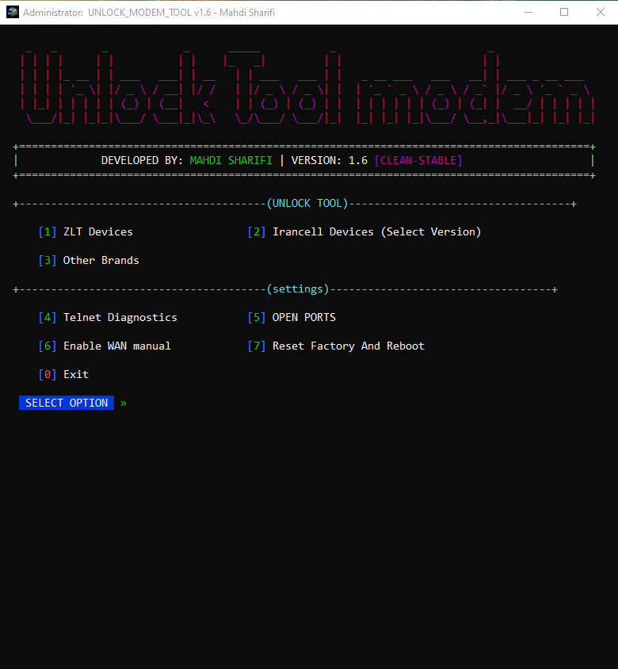
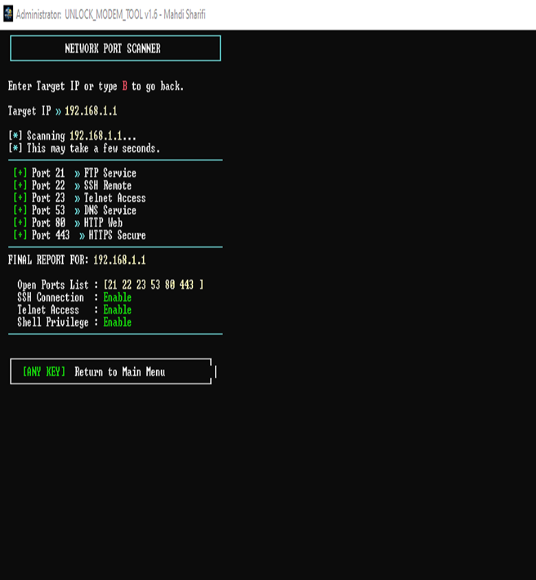

# 🔓 Universal Modem Unlocker
### e.g., “Professional LTE Modem Unlocking Tool”

---

# 🇬🇧 English

## Overview
Universal Modem Unlocker is a professional Windows executable tool designed to remove carrier locks from supported LTE modems.

---

## 📸 Screenshots

---

## Download
Visit the Releases section to download the latest version.

## Global Unlock Statistics
| Metric | Value |
|--------|--------|
| 🌍 Total Unlocks | 112 |
| ✅ Success Rate | 99.8 |

More details: `/docs/statistics.md`

## Documentation
Full documentation available in `/docs`

## Commercial Model
| Version | Access |
|----------|---------|
| 🟢 Community | Basic Models |
| 🔵 Pro | Extended Support |
| 🔴 Enterprise | Bulk Unlock |

## Security
Digitally signed executable.

## License
MIT License

Copyright (c) [2026] [Mahdi sharifi]

Permission is hereby granted, free of charge, to any person obtaining a copy
of this software and associated documentation files (the "Software"), to deal
in the Software without restriction, including without limitation the rights
to use, copy, modify, merge, publish, distribute, sublicense, and/or sell
copies of the Software, and to permit persons to whom the Software is
furnished to do so, subject to the following conditions:

The above copyright notice and this permission notice shall be included in all
copies or substantial portions of the Software.

THE SOFTWARE IS PROVIDED "AS IS", WITHOUT WARRANTY OF ANY KIND, EXPRESS OR
IMPLIED, INCLUDING BUT NOT LIMITED TO THE WARRANTIES OF MERCHANTABILITY,
FITNESS FOR A PARTICULAR PURPOSE AND NONINFRINGEMENT. IN NO EVENT SHALL THE
AUTHORS OR COPYRIGHT HOLDERS BE LIABLE FOR ANY CLAIM, DAMAGES OR OTHER
LIABILITY, WHETHER IN AN ACTION OF CONTRACT, TORT OR OTHERWISE, ARISING FROM,
OUT OF OR IN CONNECTION WITH THE SOFTWARE OR THE USE OR OTHER DEALINGS IN THE
SOFTWARE.

---

# 🇮🇷 فارسی

## معرفی
Universal Modem Unlocker یک ابزار حرفه‌ای ویندوزی برای حذف قفل اپراتوری مودم‌های LTE است.

---

## 📸 تصاویر

  

---
## دانلود
برای دریافت نسخه جدید به بخش Releases مراجعه کنید.

## آمار آنلاک
| شاخص | مقدار |
|--------|--------|
| 🌍 مجموع آنلاک | 112 |
| ✅ نرخ موفقیت | 99.8 |

جزئیات کامل: `/docs/statistics.md`

## مدل تجاری
| نسخه | دسترسی |
|--------|---------|
| 🟢 Community | مدل‌های پایه |
| 🔵 Pro | پشتیبانی گسترده |
| 🔴 Enterprise | آنلاک انبوه |

## امنیت
تمام نسخه‌های رسمی دارای امضای دیجیتال هستند.

## لایسنس

حق نشر (c) [2026] [مهدی شریفی]

بدینوسیله به هر شخصی که یک نسخه از این نرم‌افزار و فایل‌های مستندات مرتبط ("نرم‌افزار") را دریافت می‌کند، اجازه داده می‌شود که بدون محدودیت، از جمله بدون محدودیت، با نرم‌افزار معامله کند، از جمله حق استفاده، کپی، اصلاح، ادغام، انتشار، توزیع، اعطای مجوز فرعی و/یا فروش نسخه‌های نرم‌افزار، و به افرادی که نرم‌افزار به آنها ارائه شده است، اجازه دهد این کار را انجام دهند، مشروط به شرایط زیر:

اطلاعیه حق نشر فوق و این اطلاعیه اجازه در تمام نسخه‌ها یا بخش‌های قابل توجهی از نرم‌افزار گنجانده خواهد شد.

نرم‌افزار "به همان شکلی که هست" ارائه می‌شود، بدون هیچ گونه ضمانتی، صریح یا ضمنی، از جمله اما نه محدود به ضمانت‌های قابلیت فروش، مناسب بودن برای یک هدف خاص و عدم نقض حقوق مالکیت معنوی. تحت هیچ شرایطی، نویسندگان یا دارندگان حق نشر، مسئولیتی در قبال هرگونه ادعا، خسارت یا سایر مسئولیت‌ها، چه در قالب قرارداد، جرم یا موارد دیگر، که ناشی از، خارج از یا در ارتباط با نرم‌افزار یا استفاده یا سایر معاملات در نرم‌افزار باشد، نخواهند داشت.
